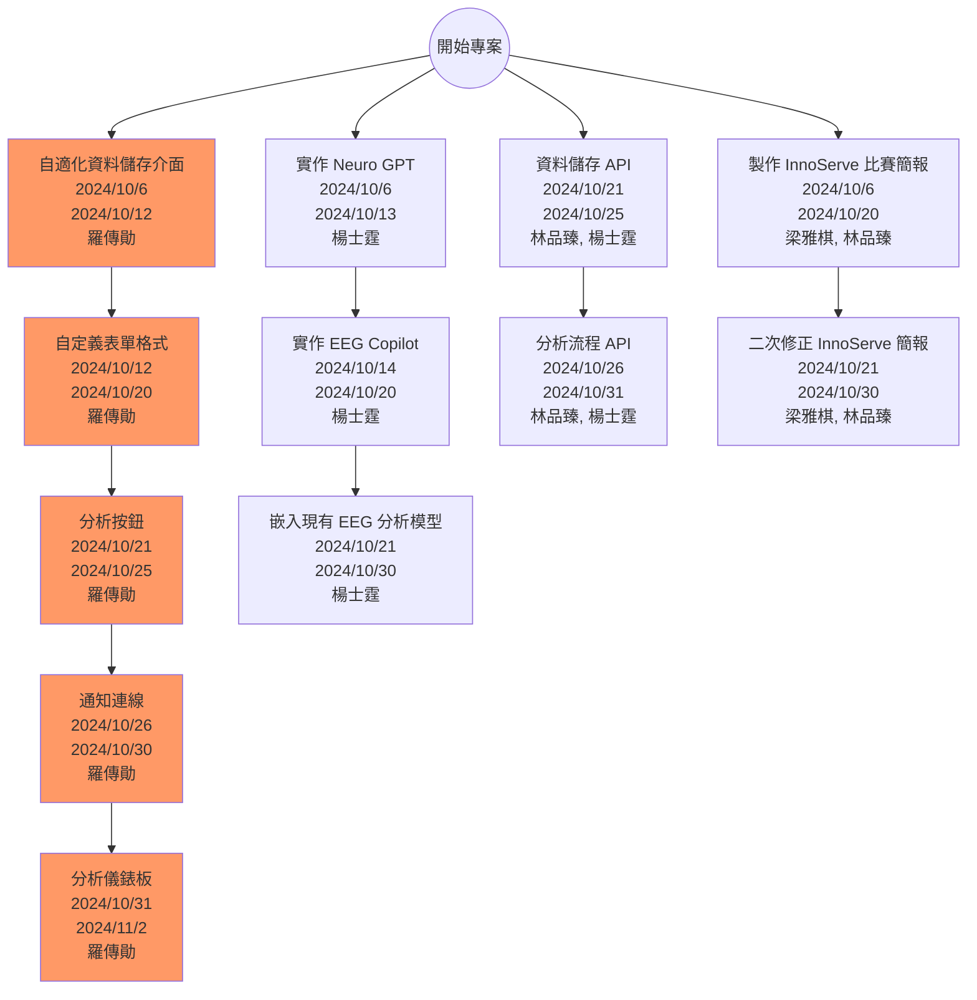
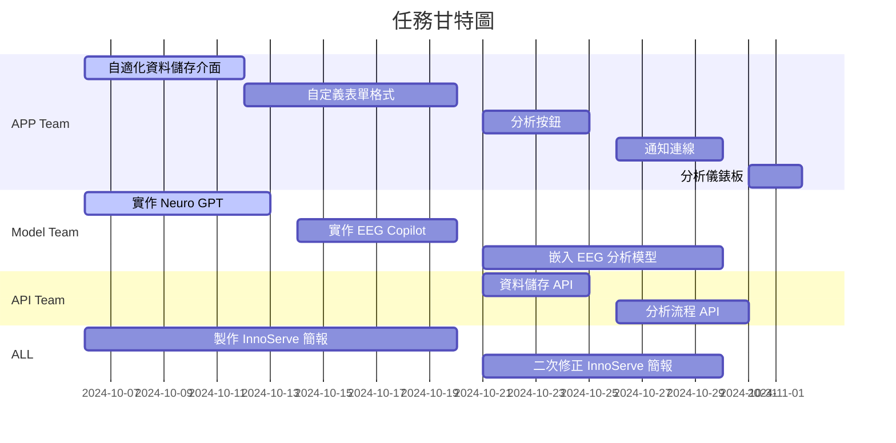
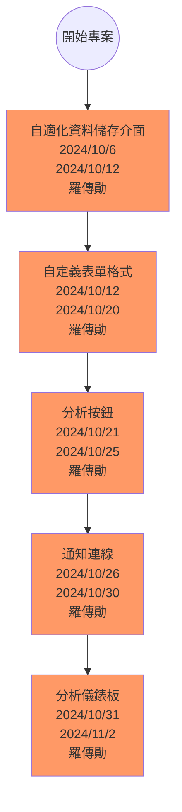
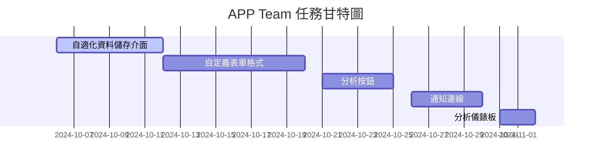
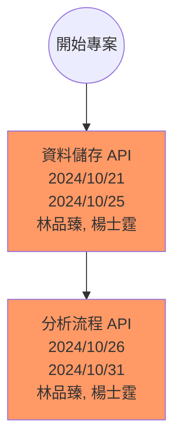
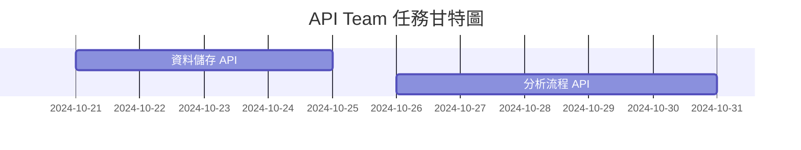
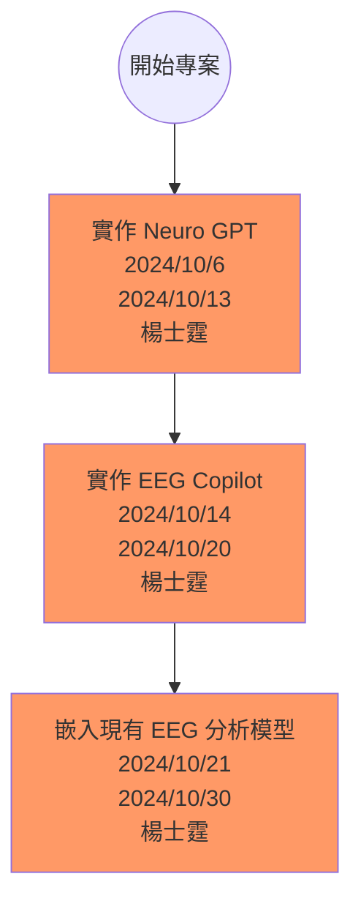
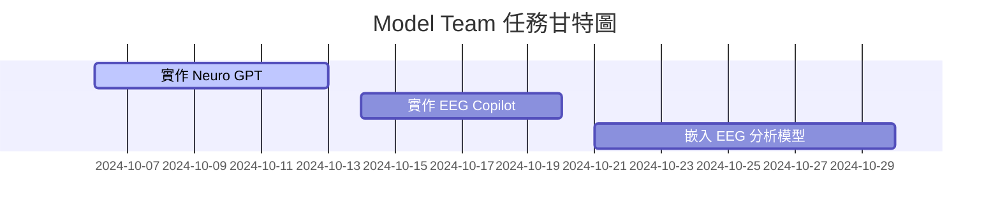
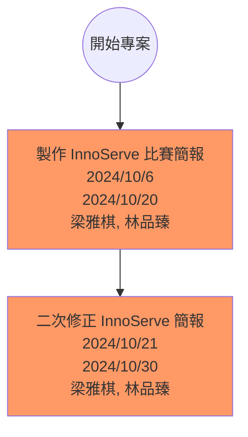
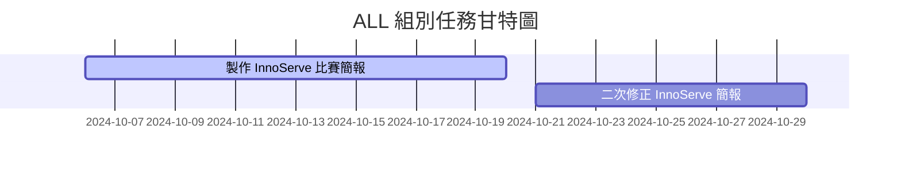

# 計畫表
## 總計畫
### 任務表
| 任務組別   | 任務編號 | 任務名稱               | 任務說明                                         | 開始時間           | 結束時間           | 時長(天) | 前置任務 | 執行人                   |
|------------|----------|------------------------|--------------------------------------------------|--------------------|--------------------|----------|----------|--------------------------|
| -          | 0        | 開始專案               | -                                                | -                  | -                  | -        | -        | -                        |
| APP Team   | 1        | 自適化資料儲存介面     | 開發類似於 one drive 的介面，並根據 API 產生資料內容  | 2024年10月6日      | 2024年10月12日     | 6        | 0        | 羅傳勛                   |
| APP Team   | 2        | 自定義表單格式          | 院方紀錄的欄位可能會是下拉式單選，因此需要讓醫生能夠開發其單選選項 | 2024年10月12日     | 2024年10月20日     | 8        | 1        | 羅傳勛                   |
| APP Team   | 3        | 分析按鈕               | 可以讓使用者選擇專案與其資訊，並點選分析按鈕進行分析 | 2024年10月21日     | 2024年10月25日     | 4        | 2        | 羅傳勛                   |
| APP Team   | 4        | 通知連線               | 選擇分析後，可等待一段時間，即有分析通知               | 2024年10月26日     | 2024年10月30日     | 4        | 3        | 羅傳勛                   |
| APP Team   | 5        | 分析儀錶板             | 取得分析結果後，需顯示結果分析儀表板                   | 2024年10月31日     | 2024年11月2日      | 2        | 4        | 羅傳勛                   |
| Model Team | 6        | 實作 Neuro GPT         | 解決資料格式不一致問題，並實作出微調 Neuro GPT 模型     | 2024年10月6日      | 2024年10月13日     | 7        | 0        | 楊士霆                   |
| Model Team | 7        | 實作 EEG Copilot       | 實作出 EEG Copilot                                 | 2024年10月14日     | 2024年10月20日     | 6        | 6        | 楊士霆                   |
| Model Team | 8        | 嵌入現有 EEG 分析模型  | 將先前成果嵌入至此系統                               | 2024年10月21日     | 2024年10月30日     | 9        | 7        | 楊士霆                   |
| API Team   | 9        | 資料儲存 API           | 將後端儲存資料的位置，傳送 API 至 APP，須注意格式檢查   | 2024年10月21日     | 2024年10月25日     | 4        | 0        | 林品臻,  楊士霆           |
| API Team   | 10       | 分析流程 API           | 將選擇的分析方法流程跑完，並回饋給使用者分析儀表板       | 2024年10月26日     | 2024年10月31日     | 5        | 9        | 林品臻,  楊士霆           |
| ALL        | 11       | 製作 InnoServe 比賽簡報 | 根據現有內容以及先前的計畫書，製作出比賽簡報             | 2024年10月6日      | 2024年10月20日     | 14       | 0        | 梁雅棋,   林品臻               |
| ALL        | 12       | 二次修正 InnoServe 簡報 | 根據現有內容以及先前的計畫書，重新修正比賽簡報           | 2024年10月21日     | 2024年10月30日     | 9        | 11       | 梁雅棋,   林品臻                |

### PERT/CPM 圖

### 甘特圖

## APP Team
### 任務表
| 任務編號 | 任務名稱             | 任務說明                                         | 開始時間         | 結束時間         | 時長(天) | 前置任務 | 執行人 |
|----------|----------------------|--------------------------------------------------|------------------|------------------|----------|----------|--------|
| 1        | 自適化資料儲存介面   | 開發類似於 one drive 的介面，並根據 API 產生資料內容  | 2024年10月6日    | 2024年10月12日   | 6        | 0        | 羅傳勛 |
| 2        | 自定義表單格式        | 院方紀錄的欄位可能會是下拉式單選，因此需要讓醫生能夠開發其單選選項 | 2024年10月12日   | 2024年10月20日   | 8        | 1        | 羅傳勛 |
| 3        | 分析按鈕             | 可以讓使用者選擇專案與其資訊，並點選分析按鈕進行分析 | 2024年10月21日   | 2024年10月25日   | 4        | 2        | 羅傳勛 |
| 4        | 通知連線             | 選擇分析後，可等待一段時間，即有分析通知               | 2024年10月26日   | 2024年10月30日   | 4        | 3        | 羅傳勛 |
| 5        | 分析儀錶板           | 取得分析結果後，需顯示結果分析儀表板                   | 2024年10月31日   | 2024年11月2日    | 2        | 4        | 羅傳勛 |

### PERT/CPM 圖

### 甘特圖

## API Team
### 任務表
| 任務編號 | 任務名稱             | 任務說明                                         | 開始時間         | 結束時間         | 時長(天) | 前置任務 | 執行人 |
|----------|----------------------|--------------------------------------------------|------------------|------------------|----------|----------|--------|
| 9        | 資料儲存 API         | 將後端儲存資料的位置，傳送 API 至 APP，須注意格式檢查   | 2024年10月21日   | 2024年10月25日   | 4        | 0        | 林品臻, 楊士霆 |
| 10       | 分析流程 API         | 將選擇的分析方法流程跑完，並回饋給使用者分析儀表板       | 2024年10月26日   | 2024年10月31日   | 5        | 9        | 林品臻, 楊士霆 |

### PERT/CPM 圖

### 甘特圖

## Model Team
### 任務表
| 任務編號 | 任務名稱             | 任務說明                                         | 開始時間         | 結束時間         | 時長(天) | 前置任務 | 執行人 |
|----------|----------------------|--------------------------------------------------|------------------|------------------|----------|----------|--------|
| 6        | 實作 Neuro GPT       | 解決資料格式不一致問題，並實作出微調 Neuro GPT 模型     | 2024年10月6日    | 2024年10月13日   | 7        | 0        | 楊士霆 |
| 7        | 實作 EEG Copilot     | 實作出 EEG Copilot                                 | 2024年10月14日   | 2024年10月20日   | 6        | 6        | 楊士霆 |
| 8        | 嵌入 EEG 分析模型    | 將先前成果嵌入至此系統                               | 2024年10月21日   | 2024年10月30日   | 9        | 7        | 楊士霆 |

### PERT/CPM 圖

### 甘特圖

## ALL Team
### 任務表
| 任務編號 | 任務名稱               | 任務說明                                         | 開始時間         | 結束時間         | 時長(天) | 前置任務 | 執行人 |
|----------|------------------------|--------------------------------------------------|------------------|------------------|----------|----------|--------|
| 11       | 製作 InnoServe 比賽簡報 | 根據現有內容以及先前的計畫書，製作出比賽簡報             | 2024年10月6日    | 2024年10月20日   | 14       | 0        | 梁雅棋,   林品臻 |
| 12       | 二次修正 InnoServe 簡報 | 根據現有內容以及先前的計畫書，重新修正比賽簡報           | 2024年10月21日   | 2024年10月30日   | 9        | 11       | 梁雅棋,   林品臻 |

### PERT/CPM 圖

### 甘特圖

